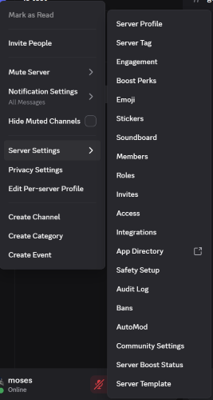
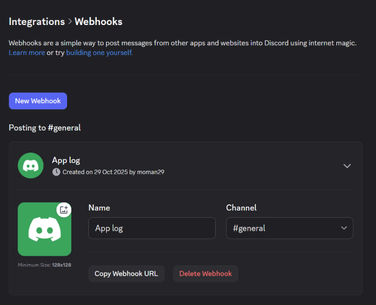

# Discord Logging Handler

[](https://www.npmjs.com/package/discord-logging-handler)
[](https://www.npmjs.com/package/discord-logging-handler)
[](LICENSE)

A lightweight Node.js logging handler that sends application logs to Discord channels via webhooks, with color-coded embeds, timestamps, and stack traces.

## Features

- Colour-coded embeds by log level
- Supports full stack traces for errors and exceptions
- Configurable minimum log level
- Async, non-blocking log delivery
- Simple drop-in integration for any Node.js project

## Installation

```bash
npm install discord-logging-handler

```

## Usage

Initialise the logger with:

### Object style (Typescript / Recommended)

```javascript
import DiscordLog from 'discord-logging-handler';

const logger = new DiscordLog('WEBHOOKURL', { level: 'LEVEL' })
```

Legacy style (Javascript)

```javascript
import DiscordLog from 'discord-logging-handler';

const logger = new DiscordLog('WEBHOOKURL', 'LEVEL')
```

- `WEBHOOKURL`: Your webhook from Discord Integrations. Use `DEV` to enable development mode (logs are suppressed during builds/tests).
- `LEVEL` (optional): The minimum level that should trigger logs to be sent to Discord. Defaults to `'ERROR'`.

Send logs with:

```javascript
logInstance.log('Message', 'LEVEL', error)
```

- `LEVEL` (optional): Log severity- `'DEBUG'`, `'INFO'`, `'WARNING'`, `'ERROR'`, `'CRITICAL'`. Defaults to `'INFO'`.
- `error` (optional): An `Error` object or exception to include in the log. Defaults to null.

### Example

```javascript
import DiscordLog from 'discord-logging-handler'

const logger = new DiscordLog('YOUR_WEBHOOK_URL', 'DEBUG')

logger.log('This is an INFO log', 'INFO')

try {
    throw new Error('Sample error')
} catch (err) {
    logger.log('An error occurred', 'ERROR', err)
}
```

## Discord Webhook Setup

Discord allows webhooks to be created via **Server Settings &rarr; Integrations**.

1. Go to **Server Settings &rarr; Integrations**
2. Under **Webhooks**, click **New Webhook**
3. Copy the generated webhook URL




## Changelog

See the full [Changelog](./CHANGELOG.md) for details on version history.

## Contributing

Contributions, issues, and feature requests are welcome!  
Feel free to open an issue or submit a pull request on [GitHub](https://github.com/mowhite29/discord-logging-handler-js).

## License

MIT License

Copyright (c) 2025 Moses White
